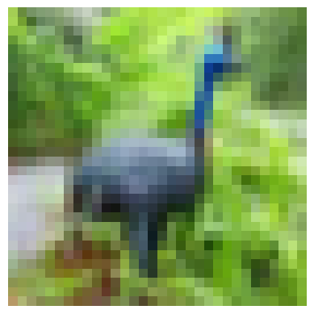
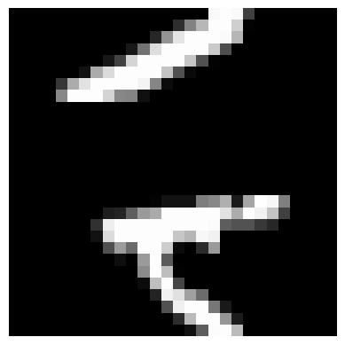
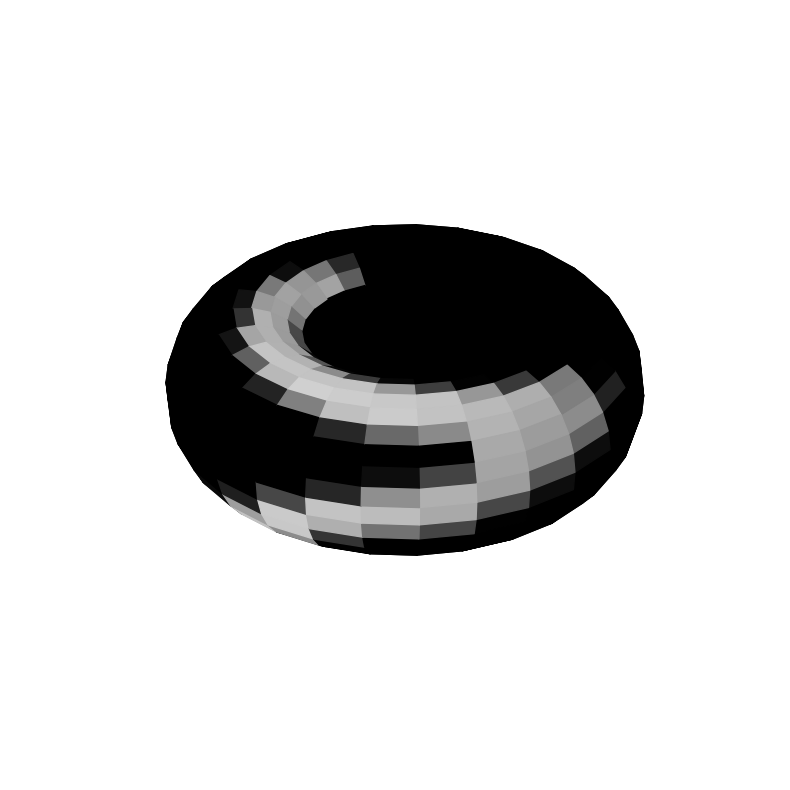
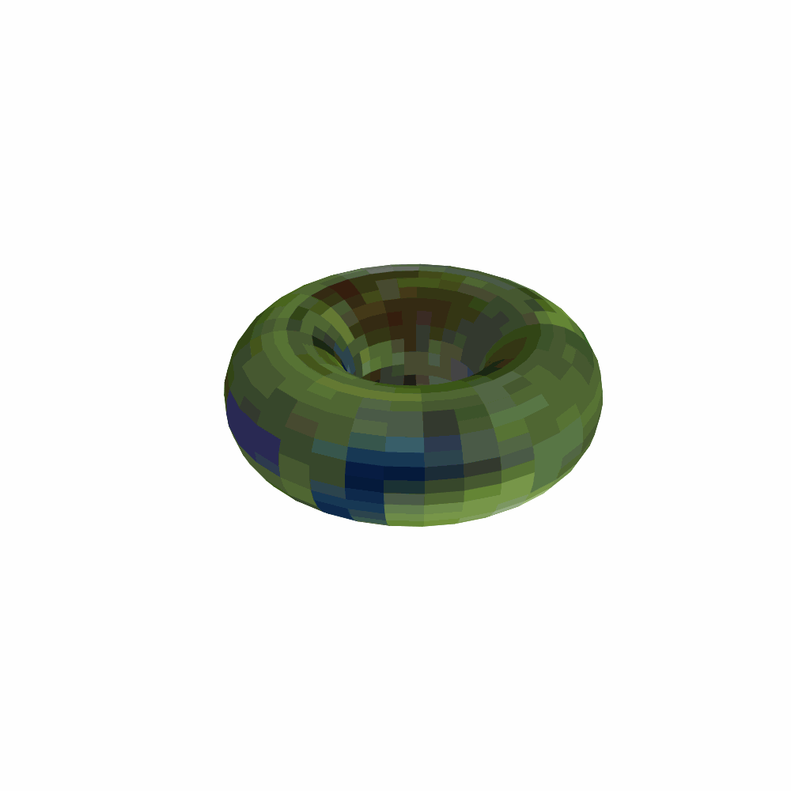

A common attribute in image classification is translation invariance, meaning that a dog is a dog no matter where in the image it is. One way to bake this attribute into a classifier is to augment the training data by including images multiple times under differen shift transformations. In cases where the important features are near the boundaries of the image, this can lead to information loss. To circumvent this the donut augmentation is introduced, where the top and bottem and the left and right borders of the image are glued together creating a torus, similar to periodic boundary conditions in physics. 
Below are images of an unshifted and a shifted image and of the image on a torus.

 

When using an CNN and convolving over the torus, different shift transformations can be applied by choosing different starting points for the convolution, enabling data augmentation without information loss.
The animation below shows the convolution of a kernel over an image on a torus. 

An implementation of the donut augmentation, that can be used within a PyTorch transformation pipeline, can be found in [utils/augmentation.py](utils/augmentation.py).