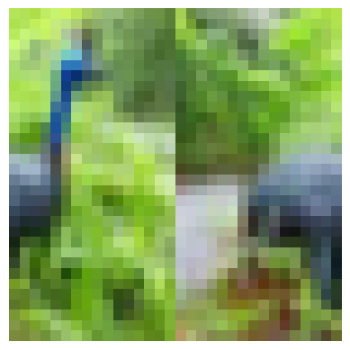
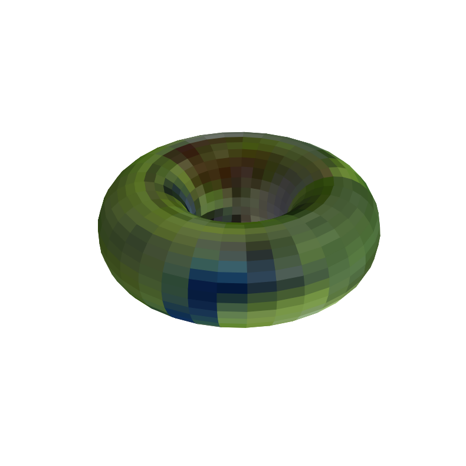

# Donut Augmentation

A common attribute in image classification is translation invariance, i.e. a dog is a dog no matter where it is in the image. One way to incorporate this attribute into a classifier is to augment the training data by including the images multiple times under different shift transformations. In cases where the important features are close to the image boundaries, this can lead to loss of information. To circumvent this, donut augmentation is introduced, where the top and bottom as well as the left and right edges of the image are glued together to form a torus, similar to periodic boundary conditions in physics. 
Below are illustrations of an unshifted and a shifted image as well as the image on a torus.

 

When using a CNN and convolving over the torus, different shift transformations can be applied by choosing different starting points for the convolution, which allows data augmentation without loss of information.
The following animation shows the convolution of a kernel over an image on a torus. 

An implementation of donut augmentation that can be used in a PyTorch transformation pipeline can be found in [utils/augmentation.py](utils/augmentation.py).

To demonstrate donut augmentation, two CNNs are trained on the MNIST dataset. The CNNs have the same architecture, with the only difference being that the regular CNN uses zero padding in the convolutional layers and the data is augmented using shift transformations, while the other CNN, called DonutCNN, uses periodic padding and the data is augmented using donut augmentation.  
The test accuracies of both CNNs over the maximum number of shifts are shown below.

For small shifts, the performance is very similar, but as can be seen, the DonutCNN allows training with larger shifts. The code for the training can be found in [/notebooks/donut_cnn.ipynb](notebooks/donut_cnn.ipynb).
